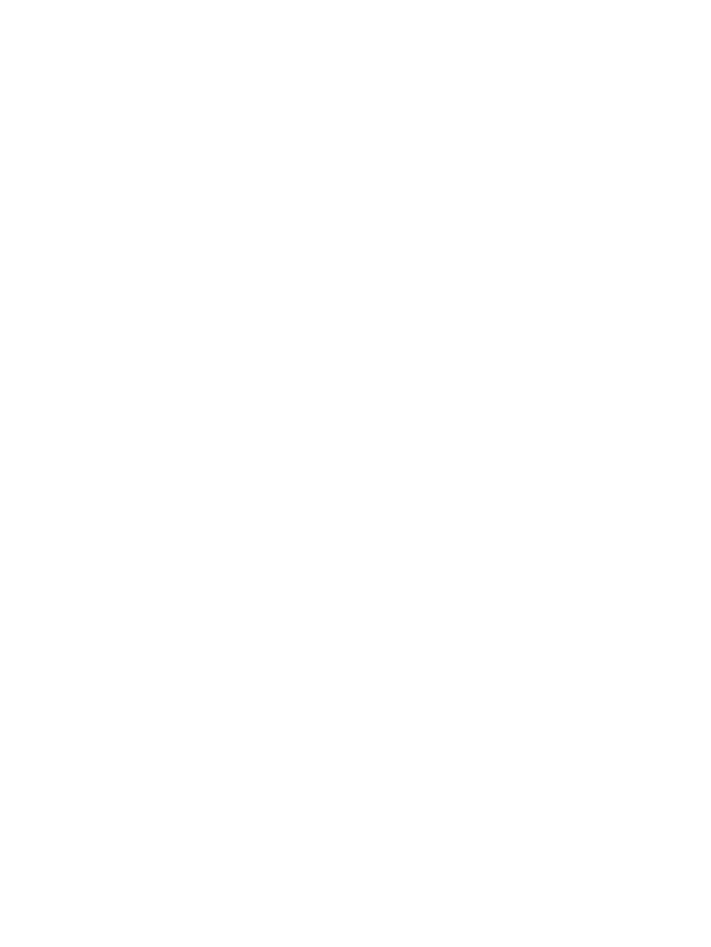
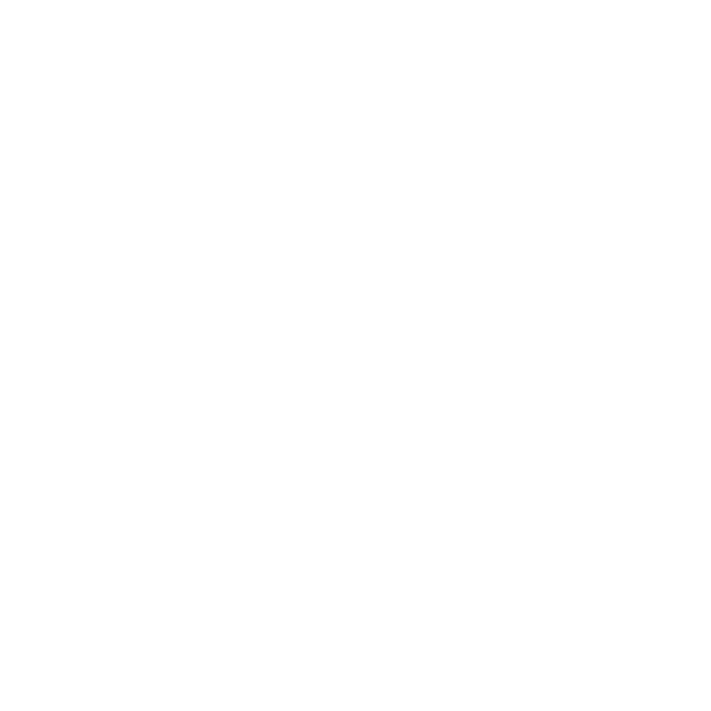

# Ronoco-VM API - Behaviour documentation

The Behaviour module is the implementation in Ronoco-vm of the different blocks accessible from Node-RED. Indeed, each block on Node-RED (plan, execute, cartesian etc) is associated with a treatment in Ronoco-vm. The beahviour module is the heart of this processing and allows to identify the existing blocks and to associate functions to them.

##  <class> Behaviour </class>
List the existing blocks and their type (control node, execution nodes etc).

Defines the functions allowing to instantiate the different blocks while checking the content of the parameters.

The interface implemented forces all these functions to have name, data and child parameters.

<member> Parameters in ronoco-vm</member>

- *name*: The name of the block (optional)
- *data*: The data used to build the block (optional for some blocks, mandatory for others)
- *child*: the child of the block to instantiate in the behaviour tree (mandatory for decorators)

### <class> Common </class>
<method> </img> selector </method>

Instantiates a [selector](https://py-trees.readthedocs.io/en/release-0.7.x/composites.html#selector) node

A selector executes each of its child behaviours in turn until one of them succeeds (at which point it itself returns RUNNING or SUCCESS, or it runs out of children at which point it itself returns FAILURE. We usually refer to selecting children as a means of choosing between priorities. Each child and its subtree represent a decreasingly lower priority path.

<method> </img> sequence </method>

Instantiates a [sequence](https://py-trees.readthedocs.io/en/release-0.7.x/composites.html#sequence) node

A sequence will progressively tick over each of its children so long as each child returns SUCCESS. If any child returns FAILURE or RUNNING the sequence will halt and the parent will adopt the result of this child. If it reaches the last child, it returns with that result regardless.

The sequence halts once it sees a child is RUNNING and then returns the result. It does not get stuck in the running behaviour.

<method> </img> parallel </method>

Instantiates a [parallel](https://py-trees.readthedocs.io/en/release-0.7.x/composites.html#parallel) node

Ticks every child every time the parallel is run (a poor man’s form of paralellism).

- Parallels will return FAILURE if any child returns FAILURE
- Parallels with policy SUCCESS_ON_ONE return SUCCESS if at least one child returns SUCCESS and others are RUNNING.
- Parallels with policy SUCCESS_ON_ALL only returns SUCCESS if all children return SUCCESS

<method> </img> condition </method>

Instantiates a [condition](https://py-trees.readthedocs.io/en/release-0.7.x/modules.html#py_trees.decorators.Condition) node

Encapsulates a behaviour and wait for its status to flip to the desired state. This behaviour will tick with RUNNING while waiting and SUCCESS when the flip occurs.

<member> Parameters </member>

- *data*: SUCCESS, FAILURE or RUNNING
- *child*: must be provided

<method> </img> inverter </method>

Instantiates a [inverter](https://py-trees.readthedocs.io/en/release-0.7.x/modules.html#py_trees.decorators.Inverter) node

A decorator that inverts the result of a class’s update function.

<member> Parameters </member>

- *child*: must be provided

<method> </img> timeout </method>

Instantiates a [timeout](https://py-trees.readthedocs.io/en/release-0.7.x/modules.html#py_trees.decorators.Timeout) node

A decorator that applies a timeout pattern to an existing behaviour. If the timeout is reached, the encapsulated behaviour’s stop() method is called with status FAILURE otherwise it will simply directly tick and return with the same status as that of it’s encapsulated behaviour.

<member> Parameters </member>

- *data*: time in seconds as an integer
- *child*: must be provided

<method> </img> service </method>
    Allows you to call a service offered by the robot. Perform `rosservice list` to get the list of available services

<member> Parameters </member>
- *name*: String - name of current block
- *name of service*: String - The name of the service to be called. The name must not be preceded by a /.
- *Parameters of service*: Array - The parameters to be provided to the service. The parameters must be enclosed in brackets and separated by commas.

<method> </img> sleep </method>
Blocks allowing to wait during n secondes

<member> Parameters </member>
- *name*: String - name of current block
- *duration of sleep*: Integer - Duration of sleep in seconds

### <class> Manipulator </class>

<method> </img> execute </method>

Execute the movement between the current position and a position given in the constructor parameter.

Use MoveGroupCommander.set_pose_target() and MoveGroupCommander.go()

<member> Parameters </member>

- *data*: identifier of a point as an integer

<method> </img> plan </method>

Planning movement between the current position and a position given in the constructor parameter.

Use MoveGroupCommander.set_pose_target() and MoveGroupCommander.plan()

<member> Parameters </member>

- *data*: identifier of a point as an integer

<method> </img> cartesian </method>

Cartesian movement between the current position and a position given in the constructor parameter

Use geometry_msgs.msg.PoseStamped(), MoveGroupCommander.compute_cartesian_path() and MoveGroupCommander.execute()

<member> Parameters </member>

- *data*: a dictionary like {'point_id' : integer, 'reliability': integer (0-100), 'eef' : float}

<method> </img> record </method>

Record all trajectories during a time specified by a parameter in constructor

<member> Parameters </member>

- *data*: a dictionary like {'identifiant' : string, 'time': integer}

<method> </img> replay </method>

Replays a previously recorded path

<member> Parameters </member>

- *data*: name of a recorded trajectory as a string

<method> </img> end_effector </method>
        Allows control of the robot end effector via an associated service passed as a parameter to ronoco.launch (the robot end effector controller must be started independently).

 This block returns SUCCESS if it has succeeded in completing the action and FAILURE if it has caught something in its path. Otherwise, the combination of "end_effector" and an "inverter" will return SUCCESS if the robot has caught something.

<member> Parameters </member>
- *name*: String - name of current block
- *data*: Array - The parameters to be provided to the service. The parameters must be enclosed in brackets and separated by commas.

### <class> Rolling </class>

<method> </img> navigate </method>
   Allows you to navigate to a point on a map while avoiding map obstacles.

<member> Parameters </member>
- *name*: String - Name of current block
- *data*: Integer - The identifier of the point in the ros parameter server (on the name "cartesianPoints"). Use Ronoco-ui to find out which points are registered.

<method> </img> coverage </method>
Block allowing to carry out a navigation with coverage, i.e. a movement covering as much surface as possible between n points

This procedure only needs to be done the first time rviz is started. Once you have done it, you do not need to do it again each time

To view the area to be scanned in rviz it is necessary to add a marker: click on "add" at the bottom left of the screen. A menu opens. Click on "Marker". Then in the menu on the left of your screen (Displays) find "Marker". Scroll down the menu and set the "Marker topic" field to "path_coverage_marker".

</img>

You can save this configuration of rviz so that you do not need to repeat this procedure in the future.

To use the block, you can do so in two ways:

either you have filled in the "Points making up the polygon" field of a point array. At this point the block will automatically scan the polygon closed by this point list.

or you have left it empty. When the system executes the block, it will give you back your hand to request the area to be scanned. To do this, go into rviz, using the "publish point" tool click on a point on the map. Repeat the operation until you draw a polygon on the map. Once the polygon is closed (i.e. the last point placed corresponds to the first point placed) ronoco will take over and scan the area.

</img>

<member> Parameters </member>
- *name*: String - Name of current block
- *robot width*:  Float - width of the robot in meter

<method> </img> patrol </method>
Block allowing to carry out a patrol, i.e. navigation on the edges of a user-defined polygon

This procedure only needs to be done the first time rviz is started. Once you have done it, you do not need to do it again each time To view the area to be scanned in rviz it is necessary to add a marker: click on "add" at the bottom left of the screen. A menu opens. Click on "Marker". Then in the menu on the left of your screen (Displays) find "Marker". Scroll down the menu and set the "Marker topic" field to "path_coverage_marker".

</img>

You can save this configuration of rviz so that you do not need to repeat this procedure in the future.

To use the block, you can do so in two ways:

either you have filled in the "Points making up the way" field of a point array. At this point the block will automatically navigate on this way.

or you have left it empty. When the system executes the block, it will give you back your hand to request the area to be patrolled. To do this, go into rviz, using the "publish point" tool click on a point on the map. Repeat the operation until you draw a way on the map. Once the way is closed (i.e. the last point placed corresponds to the first point placed) ronoco will take over and scan the area.

<member> Parameters </member>
- *name*: String - Name of current block
- *robot width*:  Float - width of the robot in meter
- *Points making up the way (optional)*: An array of identifiers (in brackets separated by commas) defining the way. The way is closed automatically.
