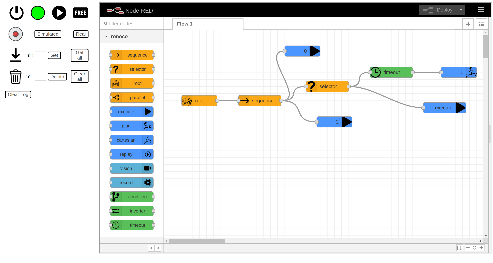

# Getting started

## Quick-start

To launch the project with a **manipulator robot**, simply run the following command

```bash
roslaunch ronoco manipulator.launch commander:=string compliant_mode:=string end_effector:=string
```

With as argument :
- *commander*: the name of the move_group in MoveIt
- *compliant_mode*: *manual* if the robot can go into compliant mode manually, *None* if the robot cannot go into compliant mode, or *the name of the service* to put it in and out of compliant mode.
- *end_effector*: the name of the service to manipulate the effector, e.g. "wsg_50_driver/move". It is not necessary to fill in this field

To start the project with a **rolling robot**, simply run the following command

```bash
roslaunch ronoco rolling.launch namespace:=string
```
With as argument :
- *namespace*: the namespace for your robot without last / (default " ")

Whether the robot is a rolling robot or a manipulator arm, once ronoco is launched **it is necessary to establish the connection with the robot**. For example in the case of a ur3 in simulation it will be necessary to launch
```bash
roslaunch ur3_moveit_config demo.launch config:=true
```
in parallel to ronoco manipulator. For more details please refer to the different [examples](examples.md).
## Manual start

To use ronoco it is necessary to launch the ROS modules corresponding to your robot and then the different modules of ronoco.

Regarding the launching of ROS modules the procedure is different for each robot, to make ronoco work it is necessary to have a roscore and Moveit running. See the different examples on [Poppy Ergo Jr](poppy.md) or [Universal Robots 3](ur3.md) for more details.

First set parameters in rosparam
```bash
#for manipulator arm
rosparam set commander string
rosparam set compliant_mode string
rosparam set end_effector string

#for rolling roboto
rosparam set namespace string
```

It is then necessary to launch the three modules.
```bash
# Launching of nodered in a terminal
node-red
```
```bash
# Launching of ronoco-vm in another terminal
cd $HOME/catkin_ws/src/ronoco/ronoco-vm/
python3 ronoco_vm/run.py
```
```bash
# Launching of ronoco-ui in another terminal
cd $HOME/catkin_ws/src/ronoco/ronoco-ui/
npm start
```

Once all the modules are running go to your [localhost:8080](http://localhost:8080/) and you will arrive at the ronoco page:


