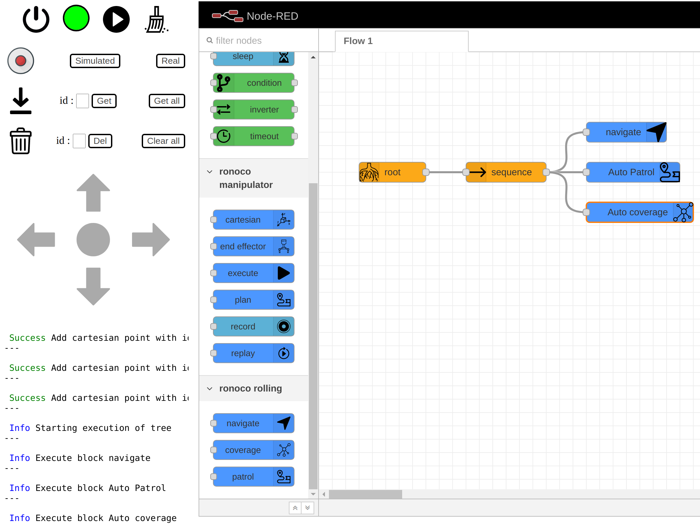

Example on turtlebot 3 burger
=============================

First, install the necessary dependencies

```bash
sudo apt install ros-noetic-joy ros-noetic-teleop-twist-joy \
  ros-noetic-teleop-twist-keyboard ros-noetic-laser-proc \
  ros-noetic-rgbd-launch ros-noetic-rosserial-arduino \
  ros-noetic-rosserial-python ros-noetic-rosserial-client \
  ros-noetic-rosserial-msgs ros-noetic-amcl ros-noetic-map-server \
  ros-noetic-move-base ros-noetic-urdf ros-noetic-xacro \
  ros-noetic-compressed-image-transport ros-noetic-rqt* ros-noetic-rviz \
  ros-noetic-gmapping ros-noetic-navigation ros-noetic-interactive-markers ros-noetic-tf2-tools

sudo apt install ros-noetic-dynamixel-sdk
sudo apt install ros-noetic-turtlebot3-msgs
sudo apt install ros-noetic-turtlebot3
```

## With a simulated tb3

For a simulation robot install the turtlebot simulation package

```bash
cd $HOME/catkin_ws/src
git clone -b noetic-devel https://github.com/ROBOTIS-GIT/turtlebot3_simulations.git
cd ..
catkin_maker
source devel/setup.bash
```

Then launch gazebo in a first terminal
```bash
roslaunch turtlebot3_gazebo turtlebot3_house.launch
```

You can now launch ronoco in another terminal
```bash
roslaunch ronoco rolling.launch
```

At this point you can choose to :
- map the environment
- navigate on an existing map

To map the environment, simply issue the command

```bash
roslaunch turtlebot3_slam turtlebot3_slam.launch
```

This will open rviz and the robot will start to build the environment around it. You can move it around using ronoco's directional arrows.

Once you are happy with the map, don't close the previous terminal and run the command

```bash
rosrun map_server map_saver -f ~/map
```

Once this program is finished you can shut down the two previous terminals and move on to navigation.

To perform the navigation run the following command
```bash
roslaunch turtlebot3_navigation turtlebot3_navigation.launch
```

Once rviz is open you can create behaviour trees using ronoco

## With a real tb3 (ros4pro)

To control a real turtlebot 3 with the ros4pro package (refer to [https://learn.e.ros4.pro/fr/navigation/turtlebot/](https://learn.e.ros4.pro/fr/navigation/turtlebot/) for more information)

First, install the ros4pro package
```bash
cd $HOME/catkin_ws/src
git clone https://github.com/ros4pro/turtlebot3_ros4pro.git
cd $HOME/catkin_ws && catkin_make
source devel/setup.bash
```

You can now start ronoco with the command

```bash
roslaunch ronoco rolling.launch namespace:=/tb3
```

In a first terminal connect to the robot via ssh and then run the command `roslaunch turtlebot3_ros4pro bringup.launch`.

For mapping

Run the command `roslaunch turtlebot3_ros4pro slam.launch`. RViz will launch and you should see the robot, the LIDAR scans and the map under construction. You can move the robot using the directional arrows of ronoco

In a new terminal run the command `roscd turtlebot3_ros4pro/maps/` to go to the folder where the map is saved.

The following command will delete the previous map if there is one, or make a copy if you want to keep it. Run the command `roslaunch turtlebot3_ros4pro map_saver.launch` which will save the map in the maps folder of the turtlebot3_ros4pro package (maps.yaml and maps.pgm files).

For navigation run the roslaunch command turtlebot3_ros4pro navigation.launch to start location and autonomous navigation. Once rviz is open you can create behaviour trees using ronoco

For example the execution of the tree below
<center>
</img>
</center>

This tree will ask the robot to navigate to point 0, then to patrol between points 0, 1 and 2 and finally to scan the polygon formed by points 0, 1 and 2. Its execution gives the result below.

<center>
<video controls width="100%">
<source src="../static/tb3.mp4" type="video/mp4">
</video>
</center>


